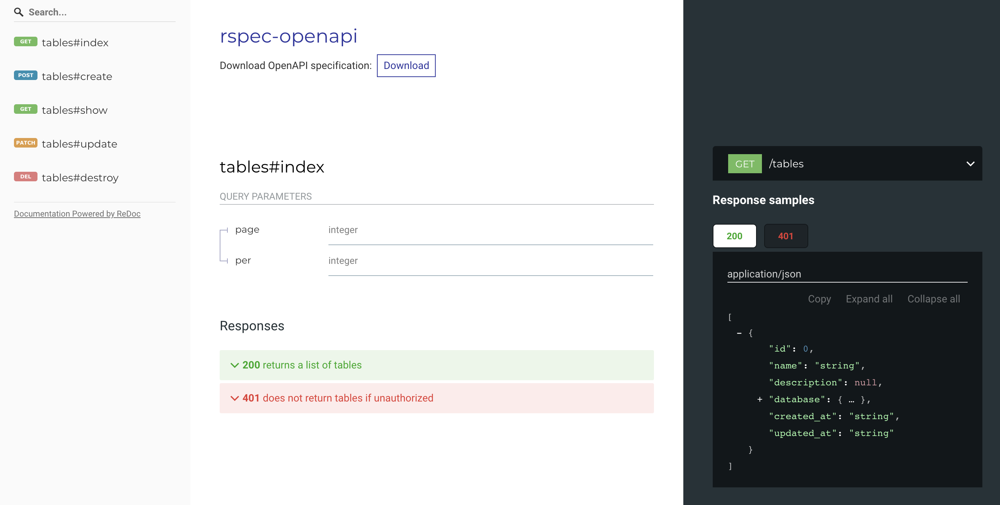

# rspec-openapi [](https://rubygems.org/gems/rspec-openapi) [](https://github.com/exoego/rspec-openapi/actions/workflows/test.yml) [](https://codecov.io/gh/exoego/rspec-openapi) [](https://www.ruby-toolbox.com/projects/rspec-openapi) [](https://deepwiki.com/exoego/rspec-openapi)


Generate OpenAPI schema from RSpec request specs.

## What's this?

There are some gems which generate OpenAPI specs from RSpec request specs.
However, they require a special DSL specific to these gems, and we can't reuse existing request specs as they are.

Unlike such [existing gems](#links), rspec-openapi can generate OpenAPI specs from request specs without requiring any special DSL.
Furthermore, rspec-openapi keeps manual modifications when it merges automated changes to OpenAPI specs
in case we can't generate everything from request specs.

## Installation

Add this line to your application's Gemfile:

```ruby
gem 'rspec-openapi', group: :test
```

## Usage

Run rspec with OPENAPI=1 to generate `doc/openapi.yaml` for your request specs.

```bash
$ OPENAPI=1 bundle exec rspec
```

### Example

Let's say you have [a request spec](https://github.com/exoego/rspec-openapi/blob/24e5c567c2e90945c7a41f19f71634ac028cc314/spec/requests/rails_spec.rb#L38) like this:

```rb
RSpec.describe 'Tables', type: :request do
  describe '#index' do
    it 'returns a list of tables' do
      get '/tables', params: { page: '1', per: '10' }, headers: { authorization: 'k0kubun' }
      expect(response.status).to eq(200)
    end

    it 'does not return tables if unauthorized' do
      get '/tables'
      expect(response.status).to eq(401)
    end
  end

  # ...
end
```

If you run the spec with `OPENAPI=1`,

```
OPENAPI=1 bundle exec rspec spec/requests/tables_spec.rb
```

It will generate [`doc/openapi.yaml` file](./spec/rails/doc/openapi.yaml) like:

```yml
openapi: 3.0.3
info:
  title: rspec-openapi
paths:
  "/tables":
    get:
      summary: index
      tags:
      - Table
      parameters:
      - name: page
        in: query
        schema:
          type: integer
        example: 1
      - name: per
        in: query
        schema:
          type: integer
        example: 10
      responses:
        '200':
          description: returns a list of tables
          content:
            application/json:
              schema:
                type: array
                items:
                  type: object
                  properties:
                    id:
                      type: integer
                    name:
                      type: string
                    # ...
```

and the schema file can be used as an input of [Swagger UI](https://github.com/swagger-api/swagger-ui) or [Redoc](https://github.com/Redocly/redoc).




### Configuration

The following configurations are optional.

```rb
require 'rspec/openapi'

# Change the path to generate schema from `doc/openapi.yaml`
RSpec::OpenAPI.path = 'doc/schema.yaml'

# Change the output type to JSON
RSpec::OpenAPI.path = 'doc/schema.json'

# Or generate multiple partial schema files, given an RSpec example
RSpec::OpenAPI.path = -> (example) {
  case example.file_path
  when %r[spec/requests/api/v1/] then 'doc/openapi/v1.yaml'
  when %r[spec/requests/api/v2/] then 'doc/openapi/v2.yaml'
  else 'doc/openapi.yaml'
  end
}

# Change the default title of the generated schema
RSpec::OpenAPI.title = 'OpenAPI Documentation'

# Or generate individual titles for your partial schema files, given an RSpec example
RSpec::OpenAPI.title = -> (example) {
  case example.file_path
  when %r[spec/requests/api/v1/] then 'API v1 Documentation'
  when %r[spec/requests/api/v2/] then 'API v2 Documentation'
  else 'OpenAPI Documentation'
  end
}

# Disable generating `example`
RSpec::OpenAPI.enable_example = false

# Change `info.version`
RSpec::OpenAPI.application_version = '1.0.0'

# Set the info header details
RSpec::OpenAPI.info = {
  description: 'My beautiful API',
  license: {
    'name': 'Apache 2.0',
    'url': 'https://www.apache.org/licenses/LICENSE-2.0.html'
  }
}

# Set request `headers` - generate parameters with headers for a request
RSpec::OpenAPI.request_headers = %w[X-Authorization-Token]

# Set response `headers` - generate parameters with headers for a response
RSpec::OpenAPI.response_headers = %w[X-Cursor]

# Set `servers` - generate servers of a schema file
RSpec::OpenAPI.servers = [{ url: 'http://localhost:3000' }]

# Set `security_schemes` - generate security schemes
RSpec::OpenAPI.security_schemes = {
  'MyToken' => {
    description: 'Authenticate API requests via a JWT',
    type: 'http',
    scheme: 'bearer',
    bearerFormat: 'JWT',
  },
}

# Generate a comment on top of a schema file
RSpec::OpenAPI.comment = <<~EOS
  This file is auto-generated by rspec-openapi https://github.com/k0kubun/rspec-openapi

  When you write a spec in spec/requests, running the spec with `OPENAPI=1 rspec` will
  update this file automatically. You can also manually edit this file.
EOS

# Generate a custom description, given an RSpec example
RSpec::OpenAPI.description_builder = -> (example) { example.description }

# Generate a custom summary, given an RSpec example
# This example uses the summary from the example_group.
RSpec::OpenAPI.summary_builder = ->(example) { example.metadata.dig(:example_group, :openapi, :summary) }

# Generate a custom tags, given an RSpec example
# This example uses the tags from the parent_example_group
RSpec::OpenAPI.tags_builder = -> (example) { example.metadata.dig(:example_group, :parent_example_group, :openapi, :tags) }

# Configure custom format for specific properties
# This example assigns 'date-time' format to properties with names ending in '_at'
RSpec::OpenAPI.formats_builder = ->(_example, key) { key.end_with?('_at') ? 'date-time' : nil }

# Change the example type(s) that will generate schema
RSpec::OpenAPI.example_types = %i[request]

# Configure which path params to ignore
# :controller and :action always exist. :format is added when routes is configured as such.
RSpec::OpenAPI.ignored_path_params = %i[controller action format]

# Configure which paths to ignore.
# You can exclude some specs via `openapi: false`.
# But, in a complex API usage scenario, you may need to include spec itself, but exclude some private paths.
# In that case, you can specify the paths to ignore.
# String or Regexp is acceptable.
RSpec::OpenAPI.ignored_paths = ["/admin/full/path/", Regexp.new("^/_internal/")]

# Your custom post-processing hook (like unrandomizing IDs)
RSpec::OpenAPI.post_process_hook = -> (path, records, spec) do
  RSpec::OpenAPI::HashHelper.matched_paths(spec, 'paths.*.*.responses.*.content.*.*.*.id').each do |paths|
    spec.dig(*paths[0..-2]).merge!(id: '123')
  end
end
```

### Can I use rspec-openapi with `$ref` to minimize duplication of schema?

Yes, rspec-openapi v0.7.0+ supports [`$ref` mechanism](https://swagger.io/docs/specification/using-ref/) and generates
schemas under `#/components/schemas` with some manual steps.

1. First, generate plain OpenAPI file.
2. Then, manually replace the duplications with `$ref`.

```yaml
paths:
  "/users":
    get:
      responses:
        '200':
          content:
            application/json:
              schema:
                type: array
                items:
                  $ref: "#/components/schemas/User"
  "/users/{id}":
    get:
      responses:
        '200':
          content:
            application/json:
              schema:
                $ref: "#/components/schemas/User"
# Note) #/components/schemas is not needed to be defined.
```

3. Then, re-run rspec-openapi. It will generate `#/components/schemas` with the referenced schema (`User` for example) newly-generated or updated.

```yaml
paths:
  "/users":
    get:
      responses:
        '200':
          content:
            application/json:
              schema:
                type: array
                items:
                  $ref: "#/components/schemas/User"
  "/users/{id}":
    get:
      responses:
        '200':
          content:
            application/json:
              schema:
                $ref: "#/components/schemas/User"
components:
  schemas:
    User:
      type: object
      properties:
        id:
          type: string
        name:
          type: string
        role:
          type: array
          items:
            type: string
```

rspec-openapi also supports `$ref` in `properties` of schemas. Example)

```yaml
paths:
  "/locations":
    get:
      responses:
        '200':
          content:
            application/json:
              schema:
                type: array
                items:
                  $ref: "#/components/schemas/Location"
components:
  schemas:
    Location:
      type: object
      properties:
        id:
          type: string
        name:
          type: string
        Coordinate:
          "$ref": "#/components/schemas/Coordinate"
    Coordinate:
      type: object
      properties:
        lat:
          type: string
        lon:
          type: string
```

Note that automatic `schemas` update feature is still new and may not work in complex scenario.
If you find a room for improvement, open an issue.

### How can I add information which can't be generated from RSpec?

rspec-openapi tries to preserve manual modifications as much as possible when generating specs.
You can directly edit `doc/openapi.yaml` as you like without spoiling the automatic generation capability.

### Can I exclude specific specs from OpenAPI generation?

Yes, you can specify `openapi: false` to disable the automatic generation.

```rb
RSpec.describe '/resources', type: :request, openapi: false do
  # ...
end

# or

RSpec.describe '/resources', type: :request do
  it 'returns a resource', openapi: false do
    # ...
  end
end
```

## Customizations

Some examples' attributes can be overwritten via RSpec metadata options. Example:

```rb
  describe 'GET /api/v1/posts', openapi: {
    summary: 'list all posts',
    description: 'list all posts ordered by pub_date',
    tags: %w[v1 posts],
    required_request_params: %w[limit],
    security: [{"MyToken" => []}],
  } do
    # ...
  end
```

**NOTE**: `description` key will override also the one provided by `RSpec::OpenAPI.description_builder` method.

## Experimental minitest support

Even if you are not using `rspec` this gem might help you with its experimental support for `minitest`.

Example:

```rb
class TablesTest < ActionDispatch::IntegrationTest
  openapi!

  test "GET /index returns a list of tables" do
    get '/tables', params: { page: '1', per: '10' }, headers: { authorization: 'k0kubun' }
    assert_response :success
  end

  test "GET /index does not return tables if unauthorized" do
    get '/tables'
    assert_response :unauthorized
  end

  # ...
end
```

It should work with both classes inheriting from `ActionDispatch::IntegrationTest` and with classes using `Rack::Test` directly, as long as you call `openapi!` in your test class.

Please note that not all features present in the rspec integration work with minitest (yet). For example, custom per test case metadata is not supported. A custom `description_builder` will not work either.

Run minitest with OPENAPI=1 to generate `doc/openapi.yaml` for your request specs.

```bash
$ OPENAPI=1 bundle exec rails t
```

## Links

Existing RSpec plugins which have OpenAPI integration:

* [zipmark/rspec\_api\_documentation](https://github.com/zipmark/rspec_api_documentation)
* [rswag/rswag](https://github.com/rswag/rswag)
* [drewish/rspec-rails-swagger](https://github.com/drewish/rspec-rails-swagger)

## Acknowledgements

* Heavily inspired by [r7kamura/autodoc](https://github.com/r7kamura/autodoc)
* Orignally created by [k0kubun](https://github.com/k0kubun) and the ownership was transferred to [exoego](https://github.com/exoego) in 2022-11-29.


## License

The gem is available as open source under the terms of the [MIT License](https://opensource.org/licenses/MIT).
