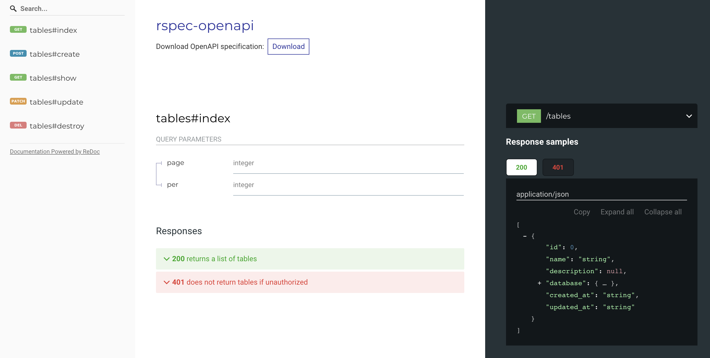

# rspec-openapi

Generate OpenAPI schema from RSpec request specs.

## What's this?

There are some gems which generate OpenAPI specs from RSpec request specs.
However, they require a special DSL specific to these gems, and we can't reuse existing request specs as they are.

Unlike such [existing gems](#links), rspec-openapi can generate OpenAPI specs from request specs without requiring any special DSL.
Furthermore, rspec-openapi keeps manual modifications when it merges automated changes to OpenAPI specs
in case we can't generate everything from request specs.

## Installation

Add this line to your application's Gemfile:

```ruby
gem 'rspec-openapi', group: :test
```

## Usage

Run rspec with OPENAPI=1 to generate `doc/openapi.yaml` for your request specs.

```bash
$ OPENAPI=1 rspec
```

### Example

Let's say you have [a request spec](./spec/requests/tables_spec.rb) like this:

```rb
RSpec.describe 'Tables', type: :request do
  describe '#index' do
    it 'returns a list of tables' do
      get '/tables', params: { page: '1', per: '10' }, headers: { authorization: 'k0kubun' }
      expect(response.status).to eq(200)
    end

    it 'does not return tables if unauthorized' do
      get '/tables'
      expect(response.status).to eq(401)
    end
  end

  # ...
end
```

If you run the spec with `OPENAPI=1`,

```
OPENAPI=1 rspec spec/requests/tables_spec.rb
```

It will generate [`doc/openapi.yaml` file](./spec/railsapp/doc/openapi.yaml) like:

```yml
openapi: 3.0.3
info:
  title: rspec-openapi
paths:
  "/tables":
    get:
      summary: 'tables #index'
      parameters:
      - name: page
        in: query
        schema:
          type: integer
      - name: per
        in: query
        schema:
          type: integer
      responses:
        '200':
          description: returns a list of tables
          content:
            application/json:
              schema:
                type: array
                items:
                  type: object
                  properties:
                    id:
                      type: integer
                    name:
                      type: string
                    # ...
```

and the schema file can be used as an input of [Swagger UI](https://github.com/swagger-api/swagger-ui) or [Redoc](https://github.com/Redocly/redoc).




### Configuration

The following configurations are optional.

```rb
# Change the path to generate schema from `doc/openapi.yaml`
RSpec::OpenAPI.path = 'doc/schema.yaml'

# Generate a comment on top of a schema file
RSpec::OpenAPI.comment = <<~EOS
  This file is auto-generated by rspec-openapi https://github.com/k0kubun/rspec-openapi

  When you write a spec in spec/requests, running the spec with `OPENAPI=1 rspec` will
  update this file automatically. You can also manually edit this file.
EOS
```

### How can I add information which can't be generated from RSpec?

rspec-openapi tries to keep manual modifications as much as possible when generating specs.
You can directly edit `doc/openapi.yaml` as you like without spoiling the automatic generation capability.

### Can I exclude specific specs from OpenAPI generation?

Yes, you can specify `openapi: false` to disable the automatic generation.

```rb
RSpec.describe '/resources', type: :request, openapi: false do
  # ...
end

# or

RSpec.describe '/resources', type: :request do
  it 'returns a resource', openapi: false do
    # ...
  end
end
```

## Project status

PoC / Experimental

This worked for some of my Rails apps, but this may raise a basic error for your app.

### Current limitations

* Generating a JSON file is not supported yet
* This only works for RSpec request specs
* Only Rails is supported for looking up a request route

### Other missing features with notes

* Delete obsoleted endpoints
  * Give up, or at least make the feature optional?
  * Running all to detect obsoleted endpoints is sometimes not realistic anyway.
* Intelligent merges
  * To maintain both automated changes and manual edits, the schema merge needs to be intelligent.
  * We'll just deep-reverse-merge schema for now, but if there's a $ref for example, modifications
    there should be rerouted to the referenced object.
  * A type could be an array of all possible types when merged.

## Links

Existing RSpec plugins which have OpenAPI integration:

* [zipmark/rspec\_api\_documentation](https://github.com/zipmark/rspec_api_documentation)
* [rswag/rswag](https://github.com/rswag/rswag)
* [drewish/rspec-rails-swagger](https://github.com/drewish/rspec-rails-swagger)

## Acknowledgements

This gem was heavily inspired by the following gem:

* [r7kamura/autodoc](https://github.com/r7kamura/autodoc)

## License

The gem is available as open source under the terms of the [MIT License](https://opensource.org/licenses/MIT).
