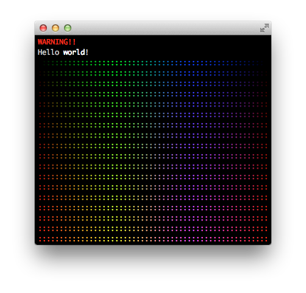

# Der ANSI Hansi

Welcome to *The ANSI Hansi*. This is your *Hipster ANSI color library*.

It allows you to produce colorized console output.

Many ANSI color libraries are already out there. However, this library tackles a few issues most of them have:

* It supports **8 color**, **16 color**, **88 color**, **256 color** and **24 bit (True Color)** mode.
* It transparently **converts colors between modes** without you having to worry about this. It uses the YUV distance (rather than the RGB distance) to closer match how our brain perceives color similarity.
* It supports **proper color nesting**.
* It can **automatically detect** how many colors the current terminal supports.
* It does **not enforce a DSL** to be used (in fact, it does not include a DSL, but it makes it really easy to build your own DSL).
* Makes it easy to define **string templates** for highlighting, but doesn't force you to use them.
* It supports **themes**, but doesn't force you to use them. Themes make semantic coloring easier.
* It supports converting **ANSI colors to CSS rules**. It does not support parsing an ANSI colored string into HTML, this would be outside the scope of this library.
* It has zero dependencies and does not include a native extension.
* It does not monkey patch anything.

## General Usage

The main API entry points are `Hansi.render(input)` , which will generate a colorized string, depending on the input, and `Hansi[input]`, which will give you a color object. You can use Hansi for your purposes by just using one of the two, but they give you different levels of access.

The following code:

``` ruby
require 'hansi'

# simple usage
puts Hansi.render(:red, "WARNING!!")
puts Hansi.render("Hello *world*!", "*" => :bold)

# generate some colors
steps  = (0..255).step(15)
render = -> options { print Hansi.render(Hansi[options], ':') }

steps.each do |red|
  steps.each { |green| render[ red: red, green: green ]}
  steps.each { |blue|  render[ red: red, green: 255 - blue, blue: blue]}
  steps.each { |blue|  render[ red: red, blue: 255 - blue ]}
  puts
end
```

Will result in output similar to this screenshot (if your terminal supports true color):



### Rendering Strings

You can render a string in a given color:

``` ruby
puts Hansi.render(:red, "this is red")

red = Hansi["#f00"]
puts Hansi.render(red, "this is red")
```

You can render an s-expression stile nested array (good for building your own DSL on top):

``` ruby
sexp = [:red, "Hello", [:yellow, ENV["USER"]], "- how are you?"]
puts Hansi.render(sexp, join: " ")
```

It is also possible to use template strings. These can use simple markup (anything enclosed between certain characters), or HTML style tags, or a combination of the two.

``` ruby
# a simple template
puts Hansi.render("foo *bar* _blah_", "*" => :red, "_" => :green)

# escaping a character
puts Hansi.render('foo *bar* _blah\_blah_', "*" => :red, "_" => :green)

# using tags, with interpolation
puts Hansi.render("<gold>Hello <underline>%s</underline>!</gold>", ENV['USER'], tags: true)
```

You can also use `render` to turn a color object into its ANIS code.

The `render` method takes a `mode` option to enforce a color mode.

``` ruby
color = Hansi["#f80"]
Hansi.render(color, mode: 256) # => "\e[38;5;208m"
Hansi.render(color, mode: 16)  # => "\e[33m"
```

### Themes

The render method takes a `theme` option. This option can have one of the following values:

* An instance of `Hansi::Theme`.
* A symbol for a predefined theme (currently `:default` or `:solarized`).
* A hash mapping rules (symbols) to other rules or color values.
* An array of any of the above.

``` ruby

my_theme = Hansi::Theme.new(foo: :yellow)

puts Hansi.render("<foo>hi</foo>", tags: true, theme: my_theme)               # bright yellow
puts Hansi.render("<foo>hi</foo>", tags: true, theme: { foo: :yellow })       # bright yellow
puts Hansi.render("<foo>hi</foo>", tags: true, theme: [:solarized, my_theme]) # solarized yellow
puts Hansi.render("<yellow>hi</yellow>", tags: true, theme: :solarized)       # solarized yellow
```

When creating a theme, you can also pass in other themes to inherit rules from:

``` ruby
my_theme = Hansi::Theme.new(:solarized, em: :base0, b: :base1)
puts Hansi.render("This <em>is</em> <b>important</b>!", theme: my_theme)
```

It is also possible to register your theme globally:

``` ruby
Hansi::Theme[:my_theme] = Hansi::Theme.new(:solarized, em: :base0, b: :base1)
puts Hansi.render("This <em>is</em> <b>important</b>!", theme: :my_theme)
```

### Color Objects

You can get access to a color object via `Hansi[]` or `Hansi::Theme#[]`.

``` ruby
Hansi[:yellow].red                    # => 255
Hansi::Theme[:solarized][:yellow].red # => 181

Hansi["#ff8300"].to_ansi(mode: 256)       # => "\e[38;5;208m"
Hansi["#ff8300"].to_web_name              # => :darkorange
Hansi["#ff8300"].to_web_name(exact: true) # => nil
```

You can also use a color object to find the closest color in a set of colors:

``` ruby
colors = [
  Hansi[:red],
  Hansi[:green],
  Hansi[:blue],
  Hansi[:orange]
]

Hansi[:yellow].closest(colors) # => Hansi[:orange]
```

## Advanced Usage

### Enforcing the default color mode

You can override the color mode Hansi has detected for the current terminal:

``` ruby
puts "Detected colors: %d" % Hansi.mode
Hansi.mode = Hansi::TRUE_COLOR
```

### Create your own DSL

Rather than defining a DSL, Hansi aims to be easily integrated with whatever tooling you use for building command line applications.

Combining for instance the s-expression style rendering with `Hansi.color_names` makes creaking a method name based DSL straight forward:

``` ruby
module ColorDSL
  def color(*args)
    Struct.new(:to_ary, :to_s).new(args, Hansi.render(args))
  end

  Hansi.color_names.each do |name|
    define_method(name) { |*args| color(name, *args) }
  end
end

extend ColorDSL
puts "Hello #{red("w", green("o", blue("r"), "l"), "d")}!"
```

### Generating CSS

Hansi does not turn ANSI escape codes into HTML for you, this would be outside of the scope for this project. However, depending on your use case, you might be able to generate semantic HTML yourself from whichever data structure you use.

In this case, Hansi can generate CSS rules for you.

``` ruby
Hansi[:red].to_css_rule # => "color: #ff0000;"
```

It can also generate a full stylesheet for a theme:

``` ruby
my_theme = Hansi::Theme.new(headline: :green, text: :springgreen, aside: :text, important: :bold)
puts my_theme.to_css
```

``` css
.headline {
  color: #008000;
}

.text, .aside {
  color: #00ff7f;
}

.important {
  font-weight: bold;
}
```

You can pass a block for generating the css selector for a given rule name:

``` ruby
puts my_theme.to_css { |name| ".hansi .#{name}" }
```

``` css
.hansi .headline {
  color: #008000;
}

.hansi .text, .hansi .aside {
  color: #00ff7f;
}

.hansi .important {
  font-weight: bold;
}
```
